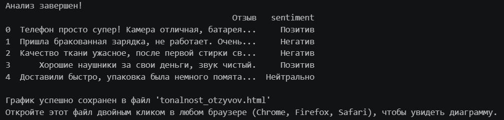

🛍️ Анализатор отзывов о товарах
Простой и понятный скрипт на Python, который автоматически читает ваши отзывы из Excel-файла и определяет их настроение: хорошее, плохое или нейтральное.

Вам больше не нужно просматривать сотни комментариев вручную! Программа сделает это за доли секунды и покажет результат в виде красивой диаграммы.

✨ Что умеет этот скрипт?
Представьте, что у вас есть колонка в Excel с отзывами покупателей. Скрипт работает как внимательный помощник:

Ищет хорошие слова. Он знает маркеры радости: «супер», «отлично», «понравилось». За каждое такое слово отзыв получает «плюсик».
Находит плохие слова. Он замечает жалобы: «брак», «сломался», «ужас». За них ставятся «минусики».
Умная проверка отрицаний ⚠️. Это самая важная часть! Скрипт понимает контекст. Фраза «упаковка не помята» будет засчитана как хорошая новость, потому что частица «не» меняет смысл плохого слова на противоположный.
Выносит вердикт. В зависимости от того, чего набралось больше — плюсов или минусов, программа ставит каждому отзыву метку: Позитив, Негатив или Нейтрально.

📊 Что вы получите на выходе?
После запуска скрипта произойдет две вещи:

В консоли: Вы увидите вашу таблицу Excel, но уже с новой добавленной колонкой sentiment. Так вы сможете глазами проверить, правильно ли сработал алгоритм на примерах.
На компьютере: Рядом со скриптом появится файл tonalnost_otzyvov.html.
Просто дважды кликните по этому файлу, и он откроется в вашем браузере (Chrome, Safari, Яндекс Браузер). Внутри будет красивая интерактивная столбчатая диаграмма, показывающая количество хороших и плохих отзывов.

💻 Как запустить? (Инструкция для новичка)
Всё очень просто, справится даже человек без опыта программирования:

Убедитесь, что у вас установлен Python.
Сохраните этот код в файл с названием code.ipynb.
Положите ваш файл с отзывами Excel (он должен называться reviews.xlsx) в ту же папку, где лежит code.ipynb.
Откройте командную строку (терминал), перейдите в эту папку и напишите команду:
python code.ipynb
Дождитесь надписи «Анализ завершен» и открывайте созданный HTML-файл!

🛠 Технические детали
Проект написан с использованием самых популярных инструментов для работы с данными:

Pandas — чтобы быстро читать таблицы Excel.
Plotly — чтобы рисовать красивые и современные графики прямо в браузере.

✨ Отличный старт для входа в мир анализа данных (Data Analysis) и первый шаг к изучению искусственного интеллекта!

## 🖍️Пример выходных данных

